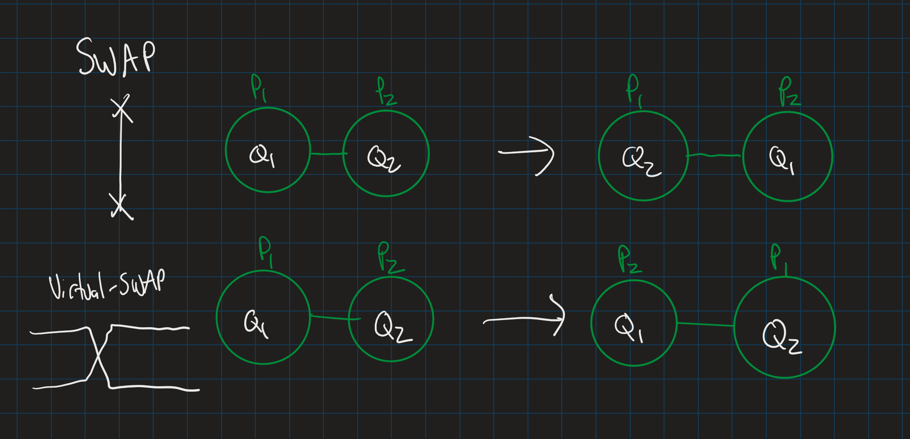
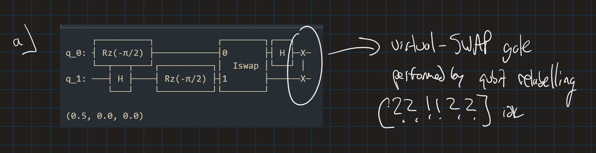

# virtual-swap transpilation

This project is exploring SWAP gate that performed via physical-logical qubit remapping.

In particular, we are interested in the following questions:

1. Can we use this vSWAP gate in routing algorithms to reduce the number of SWAP gates?

2. Can we use vSWAP as a decomposition resource?

The main reason this works is due to an identity that:
CX + SWAP = iSWAP.

Considering circuits written in a CX basis, then introducing vSWAPS is a convienient way to decompose into the iSWAP basis, a gate more naturally supported by superocnducting qubits.

Install this to draw the topologies
`sudo apt install graphviz`
